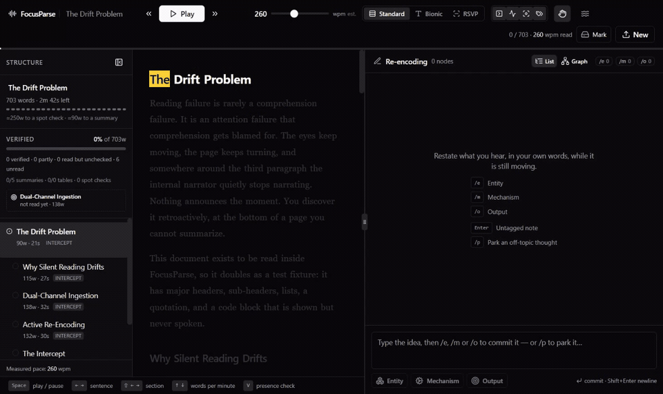

# FocusParse

Synchronized audio-visual ingestion with active kinetic re-encoding. Load a PDF,
markdown or plain-text document; FocusParse paces it with speech synthesis, locks a
word-level highlight to the audio, and refuses to let you coast past a section
boundary without restating what you just heard.

It was built to read the 524-page GCDMP for a clinical data management
certification, which is why the checks are unusually hard to dismiss — but
nothing in the pacing engine knows what it reads.

**[Try it in the browser →](https://masinobi.github.io/Focus-Parse/)**  
One page, no install, and it speaks: the demo drives your browser's own
synthesizer through a fixed passage so the caret, the clause spotlight, the
three views and all four kinds of check can be triggered by hand. It is a
walk-through, not the app — the app reads documents you load yourself.



*Recorded in Edge against the bundled sample. The first half is the caret holding the spoken word while the clause around it stays lit; the second is what happens at a section boundary.*

## Quickstart

```bash
npm install
npm run study
```

Then open http://localhost:3000 and hit **Load the sample** — a document written
to be read in the app, so nothing else needs to be downloaded first.

On Windows, you can double-click **`Study FocusParse.cmd`** instead. It builds only
when something has changed, serves the production bundle, and opens the
browser once the server really answers — about 2 seconds when the build is already
current, about a minute when it is not. Close the window to stop.

**`npm run study` is the command for reading; `npm run dev` is the command for
working on the app.** On a 524-page document, the development build costs roughly
two to three times as much to read with, in freezes and in memory —
[measured here](docs/pacing.md#read-with-a-production-build). If you switch back to
`npm run dev` after a build, delete `.next` first.

## What you need

- **Node 20 or newer**, and a browser with `SpeechSynthesis`. Chrome and Edge are
  the reference targets; Edge has by far the best voices on Windows. Firefox works,
  Safari falls back to an estimated caret. See
  [browser support](docs/speech.md#browser-support).
- **Nothing else.** No account, no server, no network — documents, notes and review
  schedules live in your own browser's IndexedDB and never leave the machine.
- **Optional:** a Gemini or Anthropic API key enables one button, *Check my recall*,
  which grades a written summary against the section it came from. Copy
  `.env.example` to `.env.local` and fill in one key. Everything else works without
  it.

## Documentation

The design notes are long on purpose — most of them exist because something was
measured and came out differently than expected.

| | |
| --- | --- |
| [Reading and pacing](docs/pacing.md) | Keeping the highlight on the spoken word, the sensory layers, reading speed |
| [Ingestion](docs/ingestion.md) | Reconstructing structure from PDF glyphs — grids, citations, `.sql` scripts |
| [The enforcement ladder](docs/enforcement-ladder.md) | Intercepts, grid interrogation, cloze spot checks, and what makes a check fair |
| [Exam preparation](docs/exam-prep.md) | Spaced retrieval, mock papers, coverage, blueprint gaps |
| [Speech and voices](docs/speech.md) | Picking a voice, and why a network voice used to go silent |
| [State, persistence and backup](docs/storage.md) | The store, the five IndexedDB stores, export and import |
| [Engineering log](docs/engineering-log.md) | The working notes, including the measurements that turned out wrong |

## Stack

Next.js 14 (App Router) · TypeScript · Tailwind CSS · shadcn/ui · Zustand · IndexedDB ·
Web Speech API · Web Audio API · pdf.js · optional Gemini or Claude summary grading.

## What it does

**Dual-channel pacing** — a words-per-minute target rather than a rate multiplier
(see [reading speed](docs/pacing.md#reading-speed)), with Standard, Bionic (bolded leading fragment, ~45% of
each word's letters) and RSVP (single word at a fixed optimal-recognition point)
views. Click any word to seek there.

**Kinetic scratchpad** — type an idea and end it with `/e`, `/m` or `/o` to commit it
instantly as an Entity / Mechanism / Output node. No Enter, no mouse; the audio never
has to stop. `Enter` alone commits an untagged note, and `/p` parks a thought that has
nothing to do with the text — stored, retrievable, and kept out of the map entirely (see [parking an
intrusive thought](docs/pacing.md#parking-an-intrusive-thought)). Nodes remember the section and word they were captured
at, and clicking their section label seeks back there.

**The captures are a graph.** Tagging said what *kind* of thing each note was and
nothing about how they connect, so "the sponsor delegates data review to the CRO, which
produces a delegation log" came out as three unrelated cards. Open a chain on a node and
every capture attaches to it and then becomes the chain itself — entity to mechanism to
output is three ordinary captures and no extra keystrokes. Anything realized later is
drawn directly: with a chain open, every node that can legally receive an edge offers
to. The Graph view lays the nodes out in `/e` `/m` `/o` lanes with the edges between
them, which is what makes an entity with no mechanism, or a mechanism producing nothing,
visible at all. Edges are kept acyclic — a cycle is not a subtler claim than a chain,
it is an unreadable one.

**Cognitive intercepts** — at every `#` / `##` boundary, playback hard-stops and a
non-dismissible full-screen dialog demands a one-sentence summary (minimum four words)
of the section just finished. Escape, outside-click and the close button are all
disabled; the only ways out are submitting or ending the session. Your own captures
for that section are hidden behind a toggle so recall comes first.

**Pre-scan structure map** — generated at load from the header hierarchy, with live
per-section time estimates, progress, and what each section has actually been asked
about (see [the coverage map](docs/exam-prep.md#the-coverage-map)). Pacing checkpoints are folded back into the
heading they were cut from: a 3,738-word section shows once, as "6 checkpoints",
rather than as six consecutive rows carrying the same title — which was itself a
reason a long document read as repetitive.

**Coverage** — the structure map reports what each section has been *asked about*, not
just how far the caret got, and points at the next section worth your time. See [the coverage map](docs/exam-prep.md#the-coverage-map).

**Blueprint gaps** — every account above measures the library against itself, so the
one question none of them can answer is the one that decides an exam: *what is on the
blueprint that I do not have?* The exam blueprint is transcribed from the published
study guide and the library is matched against it chapter by chapter, which turns the
app from a reader into an audit of your own coverage. A chapter is matched exactly or
from a listed set of aliases — never by resemblance, because a wrong match reports
coverage you do not have. See [blueprint coverage](docs/exam-prep.md#blueprint-coverage).

**Voice picker** — a filter over the hundred-odd voices a browser installs, matching
name, language and whether the voice needs the network. See [speech and voices](docs/speech.md).

**Coming back** — a check left open while you were away is put away for you after
fifteen minutes, nothing is marked, and you are offered a replay of the last two
sentences rather than an accusation. See [coming back](docs/enforcement-ladder.md#coming-back).

**Sentence gauge** — the distance to the next spot check as a row of marks that empty
as sentences finish, beside the same figure in words. See [the sentence gauge](docs/enforcement-ladder.md#the-sentence-gauge).

**Tier badges** — every section the GCDMP calls a *minimum standard* or a *best
practice* is marked as one in the map and in the reading pane, and the map can filter
to a tier. Read off the heading, never inferred from the prose. See [minimum standards and best practices](docs/exam-prep.md#minimum-standards-and-best-practices).

**Acronym drill** — every acronym your documents use, marked as you go, hardest first,
no clock. See [the acronym drill](docs/exam-prep.md#the-acronym-drill).

**Exam history** — every mock paper is kept, so the app can say how the scores are
moving and which terms have survived being learned. See [exam history](docs/exam-prep.md#exam-history).

**An exam date** — set one on the home screen and no review item is ever scheduled to
come round after it. Intervals cap at half the time remaining. See [the exam date](docs/exam-prep.md#the-exam-date).

**T-SQL stepper** — a `.sql` script loads as its commentary plus its queries, and each
query is read in the order the engine evaluates it while the screen shows it as written.
See [the T-SQL stepper](docs/ingestion.md#the-t-sql-stepper).

**Sensory masking** — brown noise under the audio, from a toggle and volume slider in
the top bar. See [brown-noise masking](docs/pacing.md#brown-noise-masking).

**Renaming** — a document's name comes from its filename, or its first heading, or
"Untitled document" for pasted text with neither. Click the title in the top bar or
the structure map to rename it; Enter commits, Escape reverts, and the new name is
written straight to IndexedDB. Recent documents can be renamed in place from the
loader without opening them, and pasted text can be named up front.

## Known limits

- PDF front matter (author lists, affiliations, citation blocks) sometimes survives
  as a section in the structure map. It is filtered where it can be recognised, but
  a line that looks typographically exactly like a heading will be read as one.
- Scanned PDFs with no text layer are rejected with a message rather than OCR'd.
- The stepper knows clause order, not semantics. It will step a query that does not run.
- A stepped query is read and never asked about: no grid, cloze or acronym is drawn from
  SQL. The enforcement ladder still fires on the prose around it, which is where the
  reasoning lives.
- A `.sql` file's headings come from comments ruled with `=` or `-`. A script that uses
  some other banner style comes out as one long section with no breaks.
- Tables and figures are linearized into prose; they read poorly aloud. A detected grid
  and a SQL fence are the two exceptions, and each has its own reader.
- A cloze carrier is only as good as the sentence it came from. Where column recovery
  fused two lines in a PDF's front matter, the blank is presented inside that fused
  sentence — the builder reproduces the chunk exactly and does not attempt to detect or
  repair damaged extraction.
- At most one check fires per sentence boundary. A grid that ends exactly where a
  section does yields its question to the intercept, and is not asked about.
- A rejoined heading loses the hyphen at its seam — "Mid-" / "study Protocol Updates"
  comes out as "Midstudy Protocol Updates". The paragraph assembler has always done
  this to a word broken across a line break, and the join follows it rather than
  inventing a second rule; from the glyphs alone a soft hyphen and a real hyphenated
  compound are the same thing.
- A voice reads at the 185 wpm baseline until it has been *heard*. The speed control
  says "est." until roughly forty words at one rate have gone by, and a reader who
  switches voice often enough never to accumulate a sample stays there.
- A section counts as verified on a spot check every blank of which was answered wrong.
  Getting through the check is what proves someone was there; recall is reported
  separately and turns red below half.
- The exam date is not carried by a backup. It lives in `localStorage` with the voice
  and the words-per-minute target; re-entering it after a restore takes ten seconds.
- An exam record keeps only the questions that were got wrong, so the app cannot later
  say which terms you have always got right.
- Papers sat before the repeat-miss report learned about acronyms are still labelled by
  whichever question kind was missed last. They render; they correct themselves as new
  papers accumulate.
- The horizon compresses intervals; it cannot compress a corpus. It guarantees that
  everything already in the queue comes round again before the exam, and says nothing
  about material never read.

## Keyboard

| Key | Action |
| --- | --- |
| `Space` | Play / pause |
| `←` `→` | Previous / next sentence |
| `⇧←` `⇧→` | Previous / next section |
| `↑` `↓` | Reading speed ±10 wpm |
| `Home` | Back to the start |
| `Esc` | Stop |
| `V` | Answer the presence check |
| `1`–`4` | Answer a grid check |

In the scratchpad, a trailing `/e` `/m` `/o` commits a tagged node, `/p` parks an
off-topic thought, and `Enter` commits an untagged one.

Transport keys go inert while you are typing and while an intercept or a check is open.

## Working on it

```bash
npm run dev          # development server
npm test             # unit tests
npm run typecheck    # tsc --noEmit
npm run lint         # next lint
```

Beyond the unit tests there is a browser probe and a set of scanners. The probe
drives a real Chromium through the app, and needs that browser downloaded once.
The scanners compile the same modules the app imports and run them over a folder
of real documents, which is why each takes a path — they exist because a parser
that is green on fixtures and wrong on a real PDF is the failure mode that
matters:

```bash
npx playwright install chromium
npm run probe "<corpus folder>"

npm run scan-headings "<corpus folder>"     # structure recovered from typography
npm run scan-columns "<corpus folder>"      # column and paragraph recovery
npm run scan-tables "<corpus folder>"       # grid detection
npm run scan-checks "<corpus folder>"       # what the enforcement ladder would ask
npm run scan-coverage "<corpus folder>"     # coverage accounting
npm run scan-citations "<corpus folder>"    # citation and journal-furniture stripping
npm run scan-entities "<corpus folder>"     # the corpus index
npm run scan-exam "<corpus folder>"         # mock paper generation
npm run scan-tiers "<corpus folder>"        # minimum standard vs best practice
npm run scan-blueprint "<corpus folder>"    # blueprint coverage
npm run scan-compare "<corpus folder>"      # near-synonym discrimination
npm run scan-sql "<sql folder>"             # T-SQL stepping
npm run scan-perf "<corpus folder>"         # reading performance, against a running server
```

**No corpus is included.** The documents this was built against are published
guidelines and regulations — free to download, not mine to redistribute — and the
exam blueprint in [src/lib/blueprint.ts](src/lib/blueprint.ts) is transcribed from
SCDM's published study guide so the app can report what is on the exam that your
own library does not cover. Point the scanners at any folder of PDFs, markdown or
text.

## Deploying

A stock Next.js app with nothing to configure: every document, note and review
schedule lives in the visitor's own browser, so an instance serves everyone and
stores nothing.

**Deploy it with no environment variables.** Without a key the grading route
reports itself unconfigured, the *Check my recall* button never renders, and
the rest of the app — which is nearly all of it — works unchanged. Verified
rather than assumed: with the keys blanked, `GET /api/check-summary` returns
`{"configured":false}` and the button is gated on that reply. A key set on a
public deployment would bill your quota to every visitor who reaches a section
boundary.

What a deployment cannot supply is a voice. Speech synthesis and the voices
installed on the machine belong to the visitor's browser, which is why the
[demo](https://masinobi.github.io/Focus-Parse/) and the app both sound
different on every computer that opens them.

## Contributing

Issues and pull requests are welcome. [CONTRIBUTING.md](CONTRIBUTING.md) covers
how to run the checks and what this project treats as a finished change —
which is not the usual list, since two of the three verification layers need a
corpus and a real browser. Security reports go through a
[private advisory](https://github.com/masinobi/Focus-Parse/security/advisories/new);
see [SECURITY.md](SECURITY.md).

## License

MIT — see [LICENSE](LICENSE).
